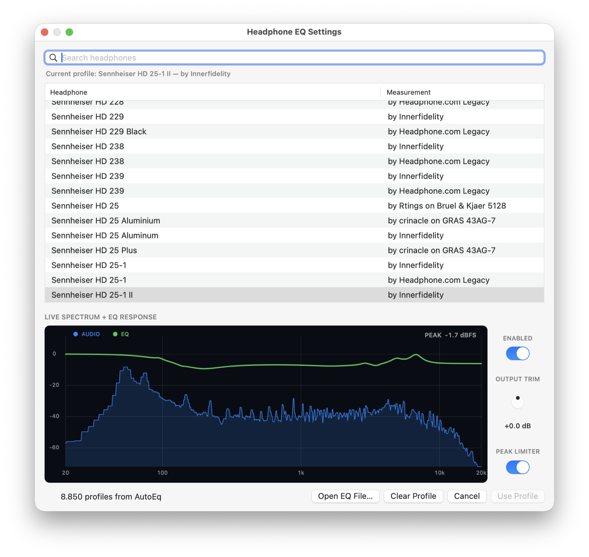

# Headphone EQ

A tiny, native macOS menu-bar equalizer for system audio. Headphone EQ loads
standard Equalizer APO parametric profiles without requiring a virtual audio
driver, a DAW, or a permanent background service.



## How it works

The app creates a private Core Audio process tap for the current output device,
mutes the original stream while the tap is being read, moves stereo samples
through a small lock-free ring buffer, processes them with macOS's native audio
equalizer, and plays the result through the selected output.

Audio processing happens entirely locally. The optional AutoEq catalog in
Settings downloads the public profile index and the selected preset from GitHub;
no audio, device information, analytics, or telemetry is transmitted. No
third-party audio plug-ins are loaded.

## Download

Pre-built, Developer ID-signed, and Apple-notarized versions are published on
the [GitHub Releases](https://github.com/mjhagen/headphone-lab-menu/releases)
page. Unzip the archive and move **Headphone EQ.app** to `/Applications`.

## Requirements

- macOS 14.2 or newer
- A stereo output device
- An internet connection when first browsing AutoEq profiles

The first launch requests **System Audio Recording** permission. This permission
allows the Core Audio tap to receive playback; it does not use the microphone.

## Equalizer APO profiles

Choose **Settings…** and use the search field to browse AutoEq's public catalog
of thousands of headphone measurements. The index is cached locally for one
week; only the selected parametric profile is downloaded and applied. Duplicate
model names remain visible because they may come from different measurement
sources. Settings identifies the active profile and highlights its matching
catalog row as soon as it opens. Selecting another result previews it
immediately on the running audio stream. Choose **Use Profile** to save it, or
close the window to restore the previously active profile. Settings overlays the
selected EQ response on a live, 16,384-sample spectrum of the processed audio.
Its peak indicator warns when the signal approaches the digital ceiling. Use
the persistent output-trim knob to attenuate the route by up to 24 dB without
restarting audio; double-click the knob to reset it to 0 dB.

**Peak Limiter** prevents digital sample clipping inside Headphone EQ. It places
Apple's native peak limiter after the headphone EQ with its minimum 1 ms
look-ahead, followed by a -0.3 dB output safety margin. It does not change the
route's buffer size or restart audio, and remains transparent until a peak
reaches the ceiling. Enabling it resets output trim to 0 dB and locks the trim
knob until the limiter is disabled. The setting persists between launches and
is controlled from the Settings window. Like any sample-peak limiter, it
cannot guarantee against inter-sample peaks reconstructed by downstream
hardware, clipping in other applications, or distortion already present in the
source.

The app computes analyzer targets at 15 Hz and Core Animation interpolates the
full-resolution paths at the display's native refresh rate (up to 120 Hz). This
keeps the motion fluid without running a dedicated 120 Hz application render
loop. All analyzer updates and animations stop immediately when Settings
closes.

The catalog is provided by the independent, MIT-licensed
[AutoEq project](https://github.com/jaakkopasanen/AutoEq); Headphone EQ is not
affiliated with AutoEq or its measurement contributors.

You can also choose **Open EQ File…** in Settings and select a local UTF-8 text
profile. Either kind of profile is copied into the app's preferences, so the
original file does not need to remain available. **Clear Profile** restores a
flat response.

Headphone EQ supports the common AutoEq and Room EQ Wizard parametric subset:

- `Preamp` (multiple values are added);
- peaking filters: `PK`, `PEQ`, and `Modal`;
- center-frequency shelves: `LS`, `LSC`, `HS`, and `HSC`;
- low- and high-pass filters: `LP`, `LPQ`, `HP`, and `HPQ`;
- band-pass (`BP`) and notch (`NO`) filters; and
- filter widths expressed as either `Q` or `BW Oct`.

Profiles may contain up to 32 enabled filters.

For example:

```text
Preamp: -6.4 dB
Filter 1: ON PK Fc 31 Hz Gain 4.2 dB Q 0.50
Filter 2: ON LS Fc 105 Hz Gain 3.0 dB Q 0.71
Filter 3: ON HS Fc 10000 Hz Gain -2.5 dB BW Oct 1.5
```

Disabled filters are ignored. Unsupported commands are rejected with their line
number instead of being silently misapplied. `GraphicEQ`, convolution, channel
matrices, device selection, includes, expressions, third-party plug-ins, and the
`LS/HS 6dB` or `12dB` corner-frequency variants are not supported.

See Equalizer APO's
[configuration reference](https://sourceforge.net/p/equalizerapo/wiki/Configuration%20reference/)
for the source format.

## Build

Install Xcode, then run:

```sh
make app
```

The application is written to `build/Headphone EQ.app`. Launch it with
`make run`, or install it in `/Applications` with `make install`.

Local builds are ad-hoc signed. Maintainers can create a hardened-runtime,
Developer ID-signed and notarized archive using a `notarytool` Keychain profile:

```sh
xcrun notarytool store-credentials "headphone-lab-menu"
make notarize VERSION=2.0.1 \
  SIGN_IDENTITY="Developer ID Application: Your Name (TEAMID)"
```

The notarized ZIP and SHA-256 checksum are written to `build/`.

## Usage

Use the headphones icon in the menu bar to see the current enabled state,
profile, peak limiter, output trim, and output device. Its only actions are
**Settings…** and **Quit**.

The Settings window lets you:

- enable or disable system-wide equalization, with the choice retained across
  launches;
- search and select a measured headphone profile from AutoEq;
- audition AutoEq profiles live before saving one;
- inspect the selected response and post-EQ audio on a live spectrum display;
- reduce output gain manually, or enable Peak Limiter to prevent sample
  clipping inside the app;
- open or clear a local Equalizer APO profile; and
- see the active response and output spectrum while making changes.

## Known limitations

- Only stereo system playback is supported.
- After changing the macOS output device, disable and re-enable processing so
  the route follows the new device.

## Development

```sh
swift test
swift build -c release
```

See [CONTRIBUTING.md](CONTRIBUTING.md) for contribution guidelines and
[SECURITY.md](SECURITY.md) for private vulnerability reporting.

## License

The source code and original project artwork are available under the
[MIT License](LICENSE).
